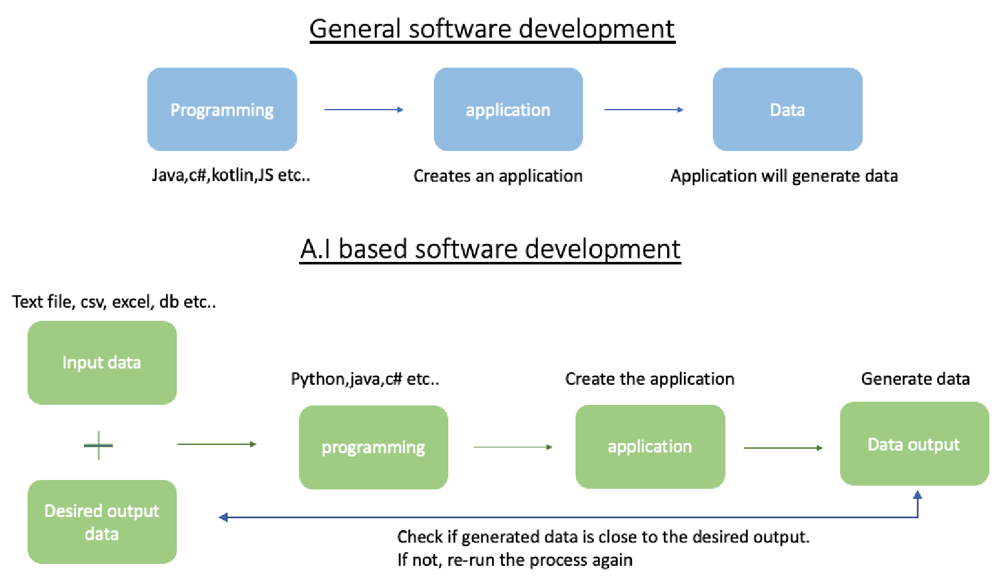
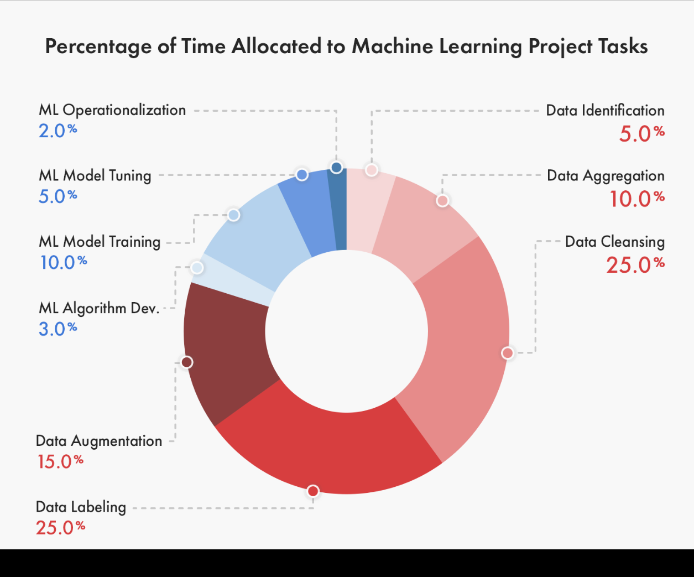
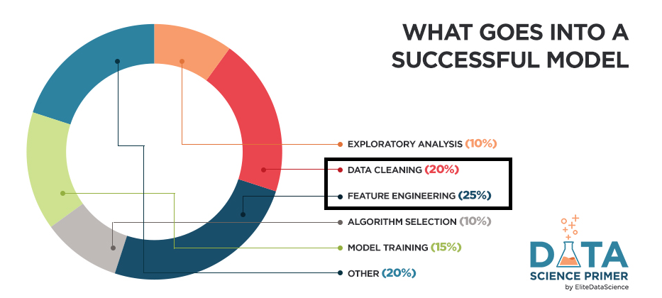
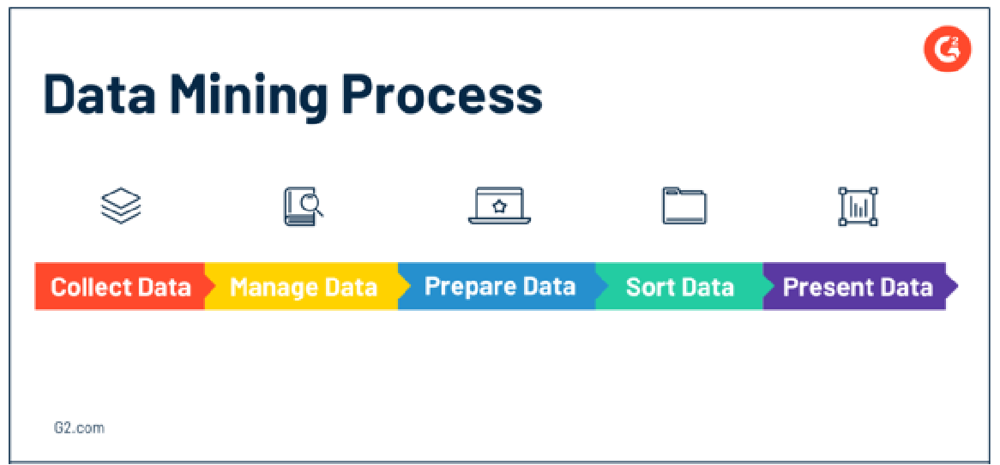
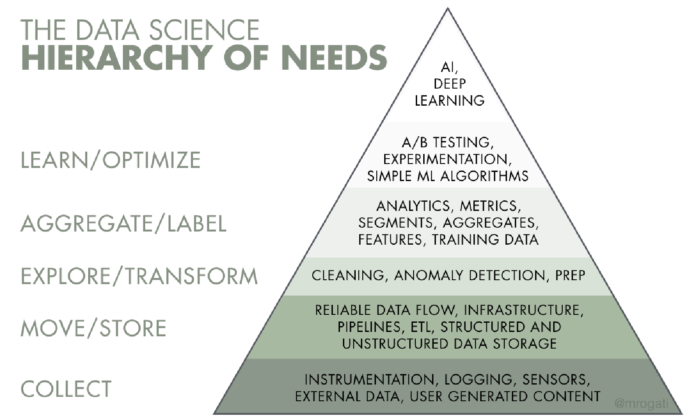
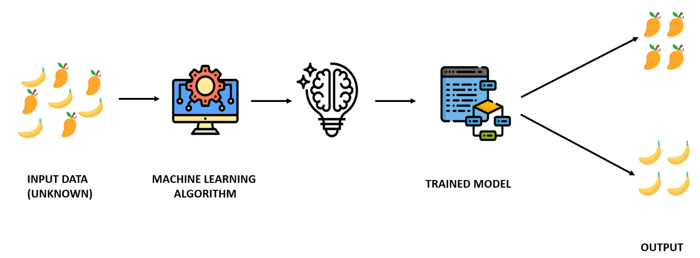
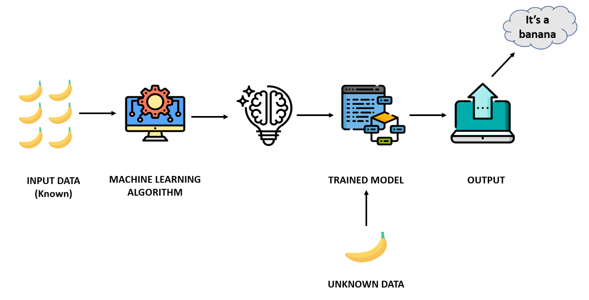
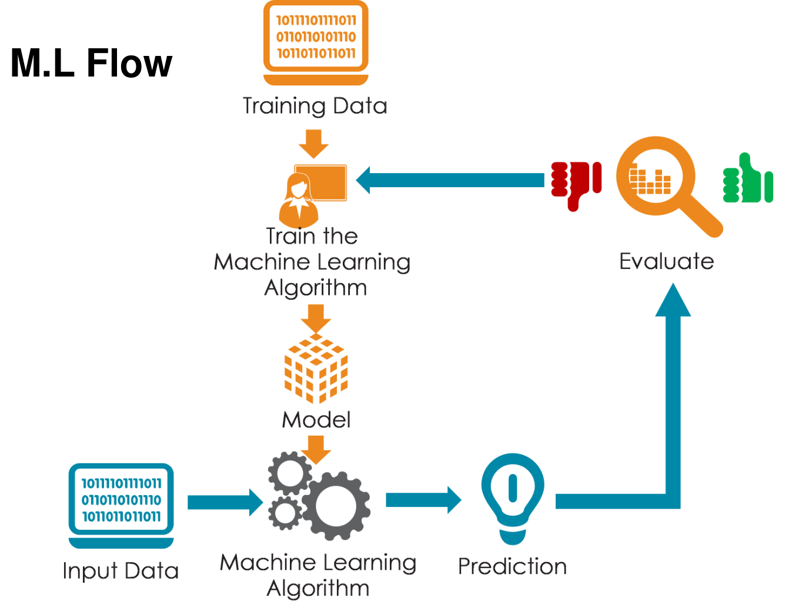
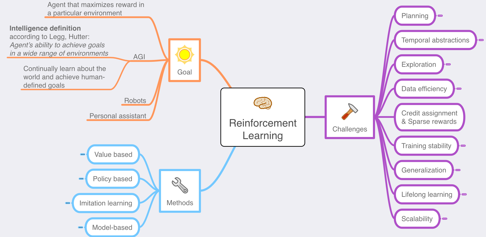

# Table of Contents

- [Table of Contents](#table-of-contents)
- [Intro](#intro)
  - [General Programming vs AI](#general-programming-vs-ai)
  - [Steps to Design an AI system](#steps-to-design-an-ai-system)
  - [Daily life of an A.I programmer](#daily-life-of-an-ai-programmer)
- [Data](#data)
  - [Data pitfalls (problems which can occur with data)](#data-pitfalls-problems-which-can-occur-with-data)
  - [How to work with data ?](#how-to-work-with-data-)
    - [1. Data labeling / annotation](#1-data-labeling--annotation)
    - [2. Data annonimization](#2-data-annonimization)
    - [3. Synthetic data](#3-synthetic-data)
    - [4. Data preperation](#4-data-preperation)
    - [5. Data wrangling](#5-data-wrangling)
    - [6. Data mining](#6-data-mining)
    - [7. Data warehousing](#7-data-warehousing)
    - [8. Data Engineering](#8-data-engineering)
- [Machine Learning](#machine-learning)
  - [Unsupervised](#unsupervised)
  - [Supervised](#supervised)
    - [Classification](#classification)
    - [Regression](#regression)
  - [Reinforcement learning](#reinforcement-learning)
- [Limitations](#limitations)

# Intro
- AI smart and dumb at once
- AI is when we artificially introduce intelligence in machines
- Solves Problme without human interaction

## General Programming vs AI
| Conventional programming                                                                                             | Artificial Intelligence                                                                                                  |
| -------------------------------------------------------------------------------------------------------------------- | ------------------------------------------------------------------------------------------------------------------------ |
| Programmers look at the problem (desired output) and build an algorithm/application to solve this problem.           | Ai programmers show the problem (desired output) to the A.I algorithms and expect the algorithms to find a solution.     |
| A programmer has complete control over their application                                                             | An A.I programmer can never claim to have full control over their A.I applications. (Explainable A.I is hard to achieve) |
| The software must follow a logical series of steps to reach a conclusion (hard coded instructions by the programmer) | Ai applications use the technique of search and pattern matching                                                         |
| Its easy to explain a conventional algorithm                                                                         | Its very hard to explain how an A.I algorithm reached its desired output                                                 |
| The most important element here is the algorithm                                                                     | The most important elements here are data and algorithms                                                                 |

    

- 4th, latest and biggest industrial revolutions

- 1955, coined AI term

3 Types of AI
- Narrow (the ones we have today)
  - Dedicated to assist wiht or take over specific tasks

- General AI (Human like in capabilities)
  - Takes knowledge from one domain and transfers to other domain

- Super AI (Currently fictional, ie. The Matrix, Skynet, BLAME!)
  - Machines that are an order of magnitude smarter than humans

- Turring test (1950)
  - A test a computer can pass, to try and pass as a human
  - Google Duplex has passed this

AI has helped with:
* Human trafficking
* Money Laundering
* Terrorism
* Covid19 research
* etc ..

## Steps to Design an AI system
1. Identify the problem
2. Prepare the data
3. Choose the algorithms
4. Train the algorithms with the data
5. Run on a selected platform

## Daily life of an A.I programmer
* 80% time spend on data (cleaning, preparing, labeling, analyzing etc)
* 5% on deployment (cloud/on premise)
* 15% on A.I development

# Data

Two main points
- Data clearning
- Feature Engineering

    

    

Data is the new most valuable resource
Data is the new oil

## Data pitfalls (problems which can occur with data)
* Assuming the data is clean
  * e.g spelling  mistakes
* Outliers
  * Excluding  outliers
  * Including  outliers
* Ignroing seasonality
  * Easter vacations,  summer holidays,  black Friday etc.
* Context is critical
  * Ignoring  size when reporting  growth
* Poor data Insights
* Not connecting with external data
* Lacking business understanding

## How to work with data ?
### 1. Data labeling / annotation
- Setting labels on certain features of the data
- Can be aided by clustering on unlabeled data to accelerate the process

### 2. Data annonimization
- Faking atributes to similar but non identifying values, to retain the patterns of the data without the identifying information

### 3. Synthetic data
- Generating data to aid with padding a data set

### 4. Data preperation
This is done before the data is used for training the model, to optimise the quality of the model. Better data = Better model  

    

**Data cleansing  + feature engineering**  
* Feature  engineering,  also known as feature creation,  is the process  of constructing  new  features from existing  data  to train a machine learning  model.

**For example**  
* Character recognition
  * Features may include  histograms counting  the number of black pixels  along horizontal and vertical directions,  number of internal  holes,  stroke detection and many others. 
* Speech recognition
  * Features for recognizing  phonemes can include  noise ratios,  length of sounds,  relative power, filter matches and many others. 
* Spam detection
  * Features may include  the presence  or absence of certain email headers,  the email structure,  the language,  the frequency  of specific terms, the grammatical correctness  of the text. 
* Computer vision
  * There are a large number of possible  features, such  as edges and objects. 

**Feature Extraction**  
Extracting sub-freatures from columns(in this context features) of the data set, which can be extracted manually *(Think 3NF hahah)*
- Location
  - Adress, City, State and Zip code
- Time
  - Year, month day hour minute time ranges (numeric)
  - Weekdays or weekend (binary true / false state)
- Numbers
  - Age numbers can be turned into ranges (oridnal or categorical)

**Transformations**  
Create new features out of existing data  

**Aggregations**  
Create features which are based on combining other features in some way (grouping or putting some mathematical funcion on them)  

### 5. Data wrangling
The process of transforming and mapping data from one "raw" data form into another format with the intent of making it more appropriate and valuable for a variety of downstream purposes such as analytics.

### 6. Data mining
The process of discovering patterns in large data sets involving methods at the intersection of machine learning, statistics, and database systems.

    

### 7. Data warehousing
  * ETL programming

    

### 8. Data Engineering
  * Infrastructure,  big data, cloud etc..

    

# Machine Learning

    

    

    

    

## Unsupervised

    

* Clustering
  - Recomender Systems
    * Recommender systems are an important class of machine learning algorithms that offer "relevant" suggestions to users.
    * These systems predict the most likely product that the users are most likely to purchase and are of interest to them
  - Targeted Markeding
  - Customer Segmenation
* Dimensionality Reduction
  - Meaningful Compression
  - Structure Discovery
  - Big Data Visualisation
  - Feature Elicitation

## Supervised
Two Types 

    

### Classification

**Aplications**
- Image Classification
  - ML for detecing cat pictures
  - Collect Data (Pictures of cats and not cats)
  - Label Data (Clustering could help with labeling) (Label images with cats, and those without cats)
  - Train Model with labeled data
  - After modeled is trained, give it new images to test and see if it gives right answer

    

  - Customer Retention
  - Identity Frad Detection
  - Diagnostics

**Types**
* Support vector machines
* Decision Trees
* K-Nearest Neighbour
* Random Forest
* Logistic regression
* Naïve Bayes classifier
* ...

### Regression
**Aplications**
- Advertising Popularity Prediction
- Weather Forecasting
- Market Forecasting
- Estimating Life expectancy
- Population Growth Prediction

**Types**
* Linear Regression
* Polynomial Regression

## Reinforcement learning

    

**Aplications**
* Game AI (Guessing the sort where an AI plays a game)
* Skill Acuisition
* Learning Tasks
* Robot Navigation
* Real-time desciscions

* Reinforcement Learning is a type of machine learning technique that enables an agent to learn in an interactive environment by trial and error using feedback from its own actions and experiences.
* Whenever the model predicts or produces a result, it is penalized if the prediction is wrong or rewarded if the prediction is correct.

**Challenges with Reinforcement learning**
* The main challenge in reinforcement learning lays in preparing the simulation environment, which is highly dependant on the task to be performed. 
* Scaling and tweaking the neural network controlling the agent is another challenge. There is no way to communicate with the network other than through the system of rewards and penalties.

# Limitations