# Table of Contents

- [Table of Contents](#table-of-contents)
- [Intro](#intro)
  - [General Programming vs AI](#general-programming-vs-ai)
  - [Steps to Design an AI system](#steps-to-design-an-ai-system)
  - [Daily life of an A.I programmer](#daily-life-of-an-ai-programmer)
- [Data](#data)
  - [Data pitfalls (problems which can occur with data)](#data-pitfalls-problems-which-can-occur-with-data)
  - [How to work with data ?](#how-to-work-with-data-)
    - [1. Data labeling / annotation](#1-data-labeling--annotation)
    - [2. Data annonimization](#2-data-annonimization)
    - [3. Synthetic data](#3-synthetic-data)
    - [4. Data preperation](#4-data-preperation)
    - [5. Data wrangling](#5-data-wrangling)
    - [6. Data mining](#6-data-mining)
    - [7. Data warehousing](#7-data-warehousing)
    - [8. Data Engineering](#8-data-engineering)
- [Machine Learning](#machine-learning)
  - [Unsupervised](#unsupervised)
    - [Clustering](#clustering)
      - [K-Means Clustering](#k-means-clustering)
      - [Guassian Mixture Model](#guassian-mixture-model)
      - [Mean Shift Clustering](#mean-shift-clustering)
      - [DBSCAN](#dbscan)
    - [Association](#association)
      - [Apriori algorithm](#apriori-algorithm)
    - [Dimensionality Reduction](#dimensionality-reduction)
  - [Supervised](#supervised)
    - [Classification](#classification)
      - [Types](#types)
        - [Support vector machines](#support-vector-machines)
        - [Logistic regression (This is not a regression algorithm)](#logistic-regression-this-is-not-a-regression-algorithm)
        - [Naïve Bayes classifier](#naïve-bayes-classifier)
      - [Classification versus Clustering algorithms](#classification-versus-clustering-algorithms)
    - [Regression](#regression)
      - [Types](#types-1)
        - [Linear Regression](#linear-regression)
        - [Polynomial Regression](#polynomial-regression)
  - [Reinforcement learning](#reinforcement-learning)
- [Limitations](#limitations)
  - [Excitement around AI](#excitement-around-ai)
  - [Reality of AI](#reality-of-ai)
  - [Examples](#examples)
    - [1. Driverless Cars](#1-driverless-cars)
    - [2. Data is harder to come by](#2-data-is-harder-to-come-by)
    - [3. Hard for businesses to adopt AI](#3-hard-for-businesses-to-adopt-ai)

# Intro
- AI smart and dumb at once
- AI is when we artificially introduce intelligence in machines
- Solves Problme without human interaction

## General Programming vs AI
| Conventional programming                                                                                             | Artificial Intelligence                                                                                                  |
| -------------------------------------------------------------------------------------------------------------------- | ------------------------------------------------------------------------------------------------------------------------ |
| Programmers look at the problem (desired output) and build an algorithm/application to solve this problem.           | Ai programmers show the problem (desired output) to the A.I algorithms and expect the algorithms to find a solution.     |
| A programmer has complete control over their application                                                             | An A.I programmer can never claim to have full control over their A.I applications. (Explainable A.I is hard to achieve) |
| The software must follow a logical series of steps to reach a conclusion (hard coded instructions by the programmer) | Ai applications use the technique of search and pattern matching                                                         |
| Its easy to explain a conventional algorithm                                                                         | Its very hard to explain how an A.I algorithm reached its desired output                                                 |
| The most important element here is the algorithm                                                                     | The most important elements here are data and algorithms                                                                 |

    

- 4th, latest and biggest industrial revolutions

- 1955, coined AI term

3 Types of AI
- Narrow (the ones we have today)
  - Dedicated to assist wiht or take over specific tasks

- General AI (Human like in capabilities)
  - Takes knowledge from one domain and transfers to other domain

- Super AI (Currently fictional, ie. The Matrix, Skynet, BLAME!)
  - Machines that are an order of magnitude smarter than humans

- Turring test (1950)
  - A test a computer can pass, to try and pass as a human
  - Google Duplex has passed this

AI has helped with:
* Human trafficking
* Money Laundering
* Terrorism
* Covid19 research
* etc ..

## Steps to Design an AI system
1. Identify the problem
2. Prepare the data
3. Choose the algorithms
4. Train the algorithms with the data
5. Run on a selected platform

## Daily life of an A.I programmer
* 80% time spend on data (cleaning, preparing, labeling, analyzing etc)
* 5% on deployment (cloud/on premise)
* 15% on A.I development

# Data

Two main points
- Data clearning
- Feature Engineering

    

    

Data is the new most valuable resource
Data is the new oil

## Data pitfalls (problems which can occur with data)
* Assuming the data is clean
  * e.g spelling  mistakes
* Outliers
  * Excluding  outliers
  * Including  outliers
* Ignroing seasonality
  * Easter vacations,  summer holidays,  black Friday etc.
* Context is critical
  * Ignoring  size when reporting  growth
* Poor data Insights
* Not connecting with external data
* Lacking business understanding

## How to work with data ?
### 1. Data labeling / annotation
- Setting labels on certain features of the data
- Can be aided by clustering on unlabeled data to accelerate the process

### 2. Data annonimization
- Faking atributes to similar but non identifying values, to retain the patterns of the data without the identifying information

### 3. Synthetic data
- Generating data to aid with padding a data set

### 4. Data preperation
This is done before the data is used for training the model, to optimise the quality of the model. Better data = Better model  

    

**Data cleansing  + feature engineering**  
* Feature  engineering,  also known as feature creation,  is the process  of constructing  new  features from existing  data  to train a machine learning  model.

**For example**  
* Character recognition
  * Features may include  histograms counting  the number of black pixels  along horizontal and vertical directions,  number of internal  holes,  stroke detection and many others. 
* Speech recognition
  * Features for recognizing  phonemes can include  noise ratios,  length of sounds,  relative power, filter matches and many others. 
* Spam detection
  * Features may include  the presence  or absence of certain email headers,  the email structure,  the language,  the frequency  of specific terms, the grammatical correctness  of the text. 
* Computer vision
  * There are a large number of possible  features, such  as edges and objects. 

**Feature Extraction**  
Extracting sub-freatures from columns(in this context features) of the data set, which can be extracted manually *(Think 3NF hahah)*
- Location
  - Adress, City, State and Zip code
- Time
  - Year, month day hour minute time ranges (numeric)
  - Weekdays or weekend (binary true / false state)
- Numbers
  - Age numbers can be turned into ranges (oridnal or categorical)

**Transformations**  
Create new features out of existing data  

**Aggregations**  
Create features which are based on combining other features in some way (grouping or putting some mathematical funcion on them)  

### 5. Data wrangling
The process of transforming and mapping data from one "raw" data form into another format with the intent of making it more appropriate and valuable for a variety of downstream purposes such as analytics.

### 6. Data mining
The process of discovering patterns in large data sets involving methods at the intersection of machine learning, statistics, and database systems.

    

### 7. Data warehousing
  * ETL programming

    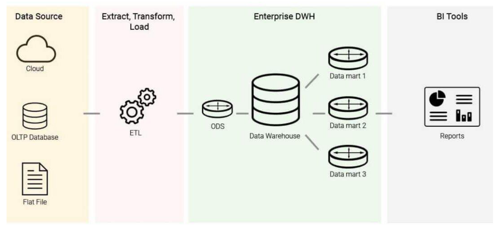

### 8. Data Engineering
  * Infrastructure,  big data, cloud etc..

    

# Machine Learning

    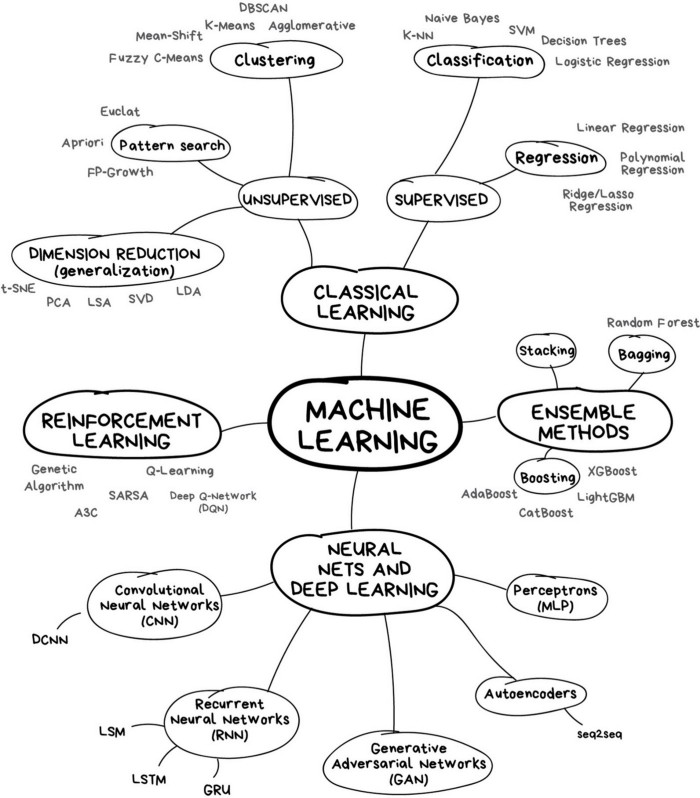

    

    

    

    

## Unsupervised

    

### Clustering
When we want want to discover groupings in data

- Recomender Systems
  * Recommender systems are an important class of machine learning algorithms that offer "relevant" suggestions to users.
  * These systems predict the most likely product that the users are most likely to purchase and are of interest to them
- Targeted Markeding
- Customer Segmenation

    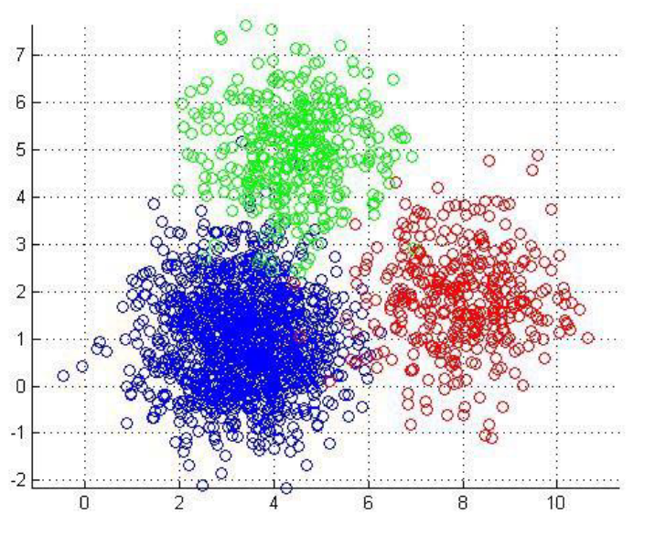

#### K-Means Clustering
K-means is a distance based algorithm where we calculate distancesbetween data points to assign a point to the cluster

    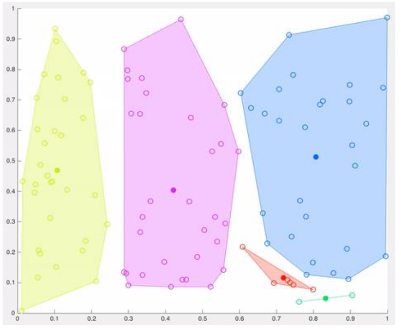

**It will stop when**
* The centroids have been stabilized – there is no change in their values since clustering has been successful
* A centroid is the imaginary or real location representing the center of the cluster.
* The defined number of iterations have been reached.

**Advantages of K-means**
* Very simple to run. (choose k and run it a number of times)
* Most projects donot need quality sensitive clusters

**Uses of K-means**
* Document classification
* Customer segmentation
* Fraud detection (insurance n bank)
* Ride share data analysis (uber etc)
* Detection of anomalies
* Sorting sensor measurements

#### Guassian Mixture Model
* Very similar to K-Means HOWEVER
* K-menas follows a circular format
* Gaussian can take on any format

    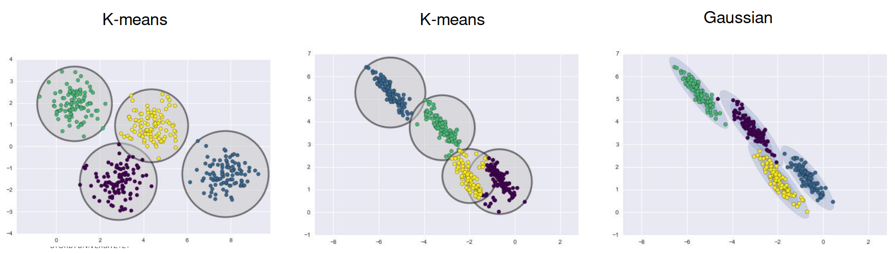

#### Mean Shift Clustering
* It locates the heavy density clusters in a data
* Uses:
  * Computer vision
  * Image processing

#### DBSCAN
Density-Based Spatial Clustering of Applications with Noise

* This is also a density based algorithm
* It separates regions by areas of low-density so that it can detect outliers between the high-density clusters.
* Uses two parameters:
* minPts: the minimum number of data points that need to be clustered together for an area to be considered high-density
* Eps: the distance used to determine if a data point is in the same area as other data points

    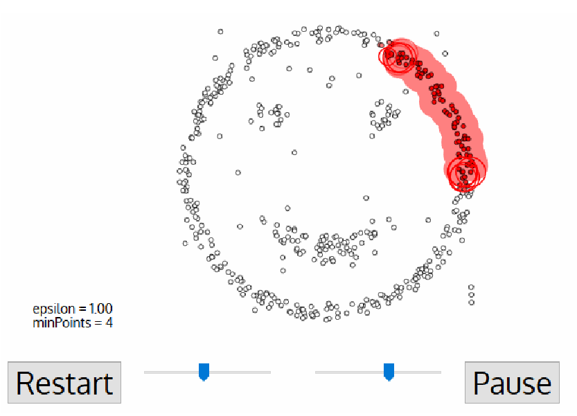

### Association
- When we want rules that describe our data

    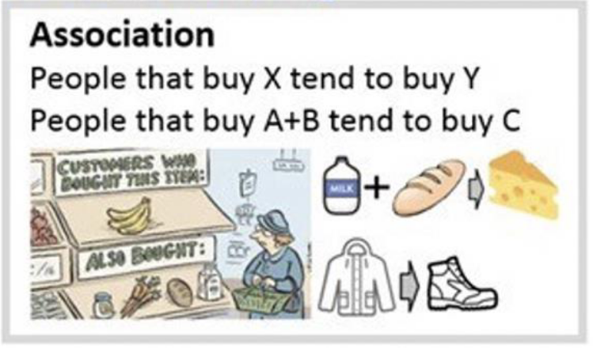
    

    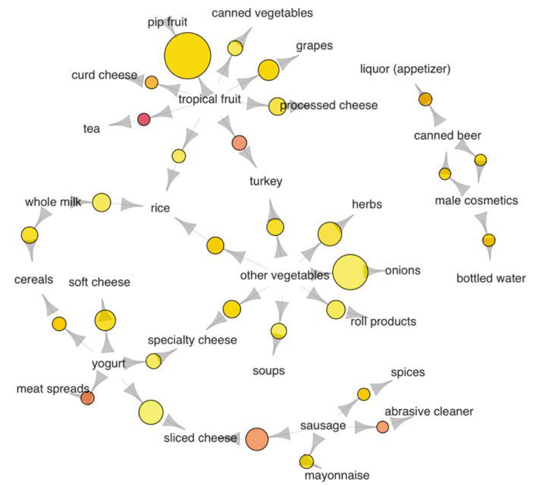

* is used for mining frequent itemsets and devising association rules.
* It is created to operate on a database containing a lot of transactions, for instance, items brought by customers in a store.
* This is the algorithm behind: “You may also like”

#### Apriori algorithm
* is used for mining frequent itemsets and devising association rules.
* It is created to operate on a database containing a lot of transactions, for instance, items brought by customers in a store.
* This is the algorithm behind: “You may also like”

### Dimensionality Reduction
- Meaningful Compression
- Structure Discovery
- Big Data Visualisation
- Feature Elicitation

## Supervised
Two Types, Classification and Regression

    

    

| Classification Algorithm                                                                                                                                               | Regression Algorithm                                                                                                        |
| ---------------------------------------------------------------------------------------------------------------------------------------------------------------------- | --------------------------------------------------------------------------------------------------------------------------- |
| In Classification, the output variable must be a discrete value.                                                                                                       | In Regression, the output variable must be of continuous nature or real value.                                              |
| The task of the classification algorithm is to map the input value(x) with the discrete output variable(y).                                                            | The task of the regression algorithm is to map the input value (x) with the continuous output variable(y).                  |
| Classification Algorithms are used with discrete data.                                                                                                                 | Regression Algorithms are used with continuous data.                                                                        |
| Classification Algorithms can be used to solve classification problems such as Identification of spam emails, Speech Recognition, Identification of cancer cells, etc. | Regression algorithms can be used to solve the regression problems such as Weather Prediction, House price prediction, etc. |
| The Classification algorithms can be divided into Binary Classifier and Multi-class Classifier.                                                                        | The regression Algorithm can be further divided into Linear and Non-linear Regression.                                      |

### Classification

    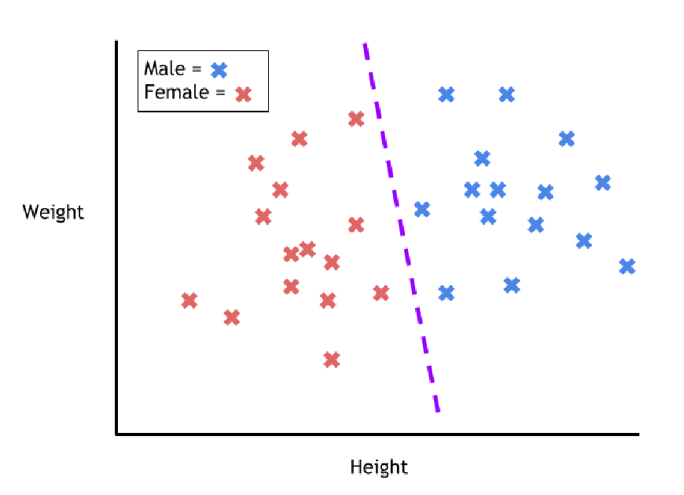

* Divides the data in classes / categories
* Use cases:
  * Spam detection (classification: spam or normal)
  * Analysis of the customer data to predict whether they will buy computer accessories (classification: Yes or No)
  * Classifying fruits from features like colour, taste, size, weight (classification: Apple, Orange, Cherry, Banana)
  * Gender classification from hair length (classification: Male or Female)
  * Stock market price prediction (classification: high or low)

**Aplications**
- Image Classification
  - ML for detecing cat pictures
  - Collect Data (Pictures of cats and not cats)
  - Label Data (Clustering could help with labeling) (Label images with cats, and those without cats)
  - Train Model with labeled data
  - After modeled is trained, give it new images to test and see if it gives right answer

    

  - Customer Retention
  - Identity Frad Detection
  - Diagnostics

#### Types
* Decision Trees
* K-Nearest Neighbour
* Random Forest

##### Support vector machines

    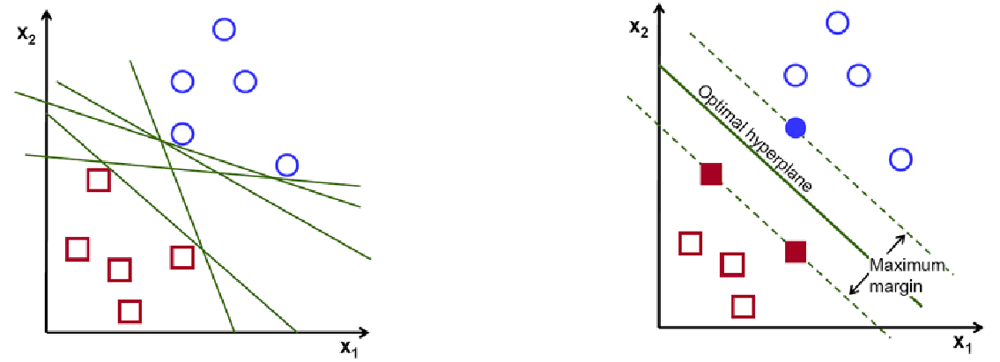

* Main use is to classify unseen data
* Supprt vector machines classifies the data by finding a clear seperation between the data points
  * It looks for a hyperplane
* Can be used both in classification and regression

**Hyperplanes**
- 3D vector for 3D data
  - Or just higher dimension plane same dimension of data
  - n dimension vector for n dimensoin data

**Uses of support vector machines**  
* Used to detect cancerous cells
* Used to predict driving routes
* Face detection
* Image classification
* Handwriting detection

**Pros**
* Effective on data sets with multiple features
* Effective in cases where number of features is greater than the data points
* Memory efficient

**Cons**
* They donot provide probability estimates. Those are calculated using an 
expensive five fold cross vsalidation
* Works best on small sample sets because of its high training time

##### Logistic regression (This is not a regression algorithm)
* is used when you have a classification problem - yes/no, pass/fail, win/lose, alive/dead, healthy/sick etc..
* It is the go-to method for binary classification problems 
* The logistic function looks like a big S and will transform any value into the range 0 to 1.
* Sigmoid function:
  * Allows to put a threshold value. e.g 0.5 (use case spam detection)

**Uses**  
* Logistic regression is used to predict the occurance of some event. e.g 
* Predict whether rain will occur or not
* spam detection, Diabetes prediction, cancer detection etc.

**Types of Logistic Regression**
* Binary logistic regression (e.g pass / fail)
* Multiclass logistic regression (e.g cats, dogs, sheep)
* Ordinal (low, medium, high)

    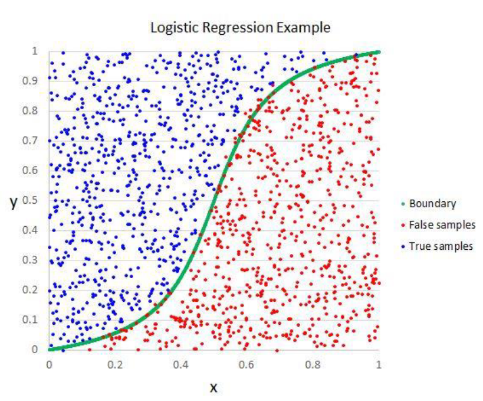

**Example for Binary Logistic Regression**
1. Visualize

    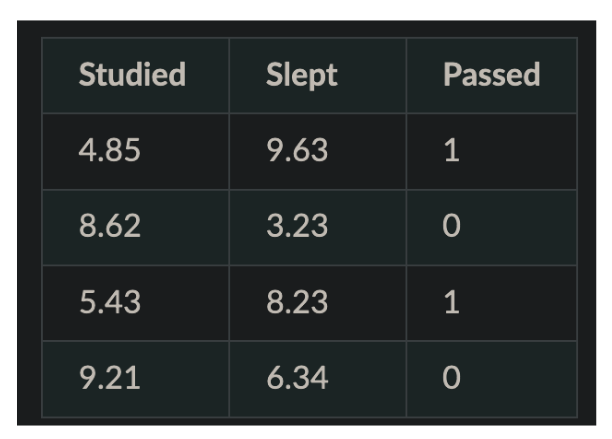
    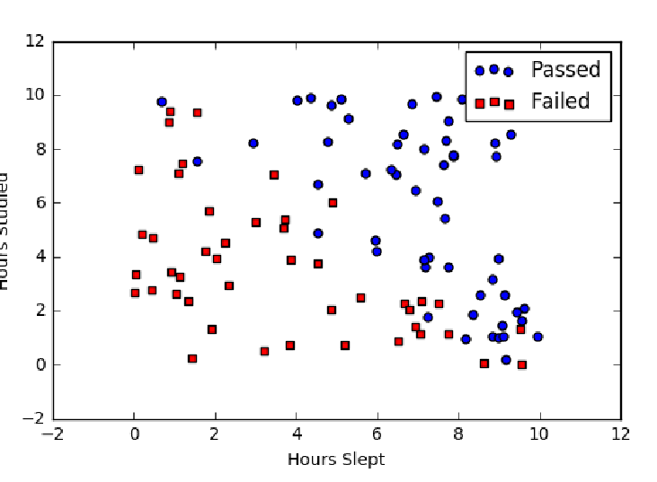

2. Sigmoid Activation
  - Making a sigmoid curve (s-curve) which defines to classification binary for making the binary descicion
3. Descision boundary
  - Setting a threshold value
4. Making predictions
  - Based on a value from the function we can place on either side of the boundary
5. Cost function
  - Measures how wrong hte model is in terms of ability to estimate relationship between two values
  - Gradient Descent
6. Map probabbilities to classes
  - Based on the dividing line, it is either class A or class B, (or more but in this case it is binary)
7. Finish Up
* Train the model
* Evaluate the model
  * Minimzie the cost with repeated iterations
* Measure the accuracy of your outputs
* Meausre the probabbility score

##### Naïve Bayes classifier
* A Naive Bayes classifier assumes that the presence of a particular feature in a class is unrelated to the presence of any other feature.
* Naive bayes does not take into account the relationship between features
* e.g a fruit may be considered to be an apple if it is red, round, and about 3 inches in diameter.
* Its an easy to build algorithm and a very powerful one.

**For Example**  
* A dog will be considered a dog because it has 4 legs and a tail
* But a Naive Bayes will consider everything a dog which has 4 legs or tail (e.g squirrel) not because its an animal. Being an animal is the relationship not legs / tail.
* A fruit may be considered to be an apple if it is red, round, and about 3 inches in diameter.

**Naive Bayes use in Natural Language Processing**

**Bayres Theorem**  
Bayes's theorem describes the probability of an event, based on prior knowledge of conditions that might be related to the event

    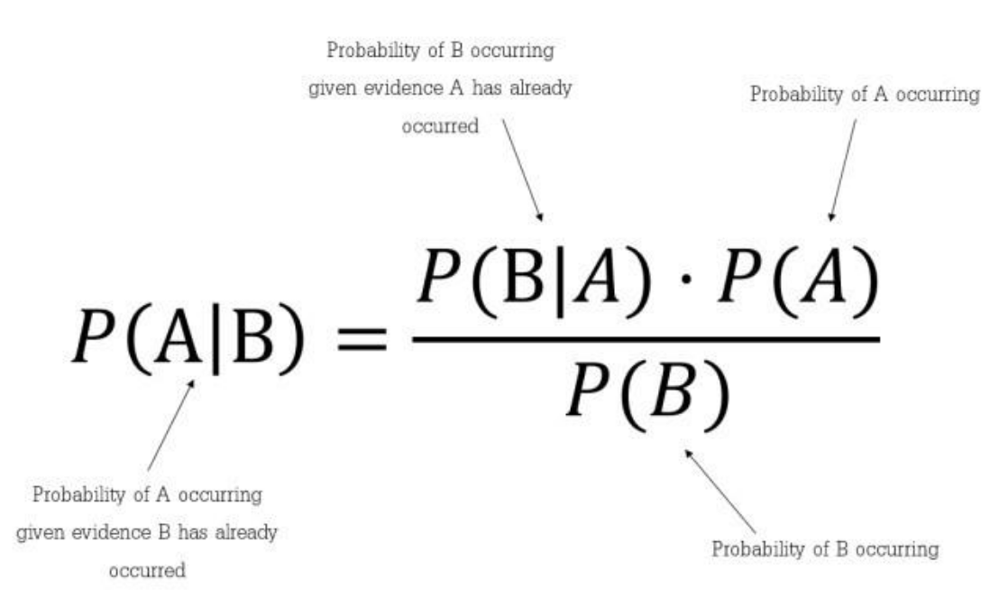

    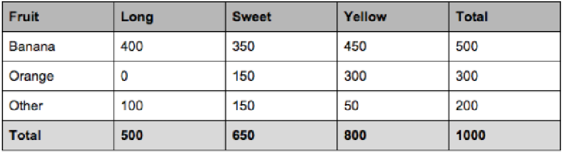

We can see that  
  * 50% of the fruits are bananas
  * 30% are oranges
  * 20% are other fruits  

We can also say  
  * From 500 bananas 400 (0.8) are Long, 350 (0.7) are Sweet and 450 (0.9) are Yellow
  * Out of 300 oranges 0 are Long, 150 (0.5) are Sweet and 300 (1) are Yellow
  * From the remaining 200 fruits, 100 (0.5) are Long, 150 (0.75) are Sweet and 50 (0.25) are Yellow

#### Classification versus Clustering algorithms
* Clustering groups similar kind of things together (And is unsupervised)
* However classification predicts similar kind of things together based on the historic trained data (and is supervised)

### Regression
* Regression models are used to predict a continuous value
* Regression is used for prediction, forecasting, time series modeling, and determining the causal effect between variables
* Examples
  * Predicting  prices of a house  given a set of features (size, price, location  etc)
  * Predicting  sales revenue  of a company based on previous  sales figures

    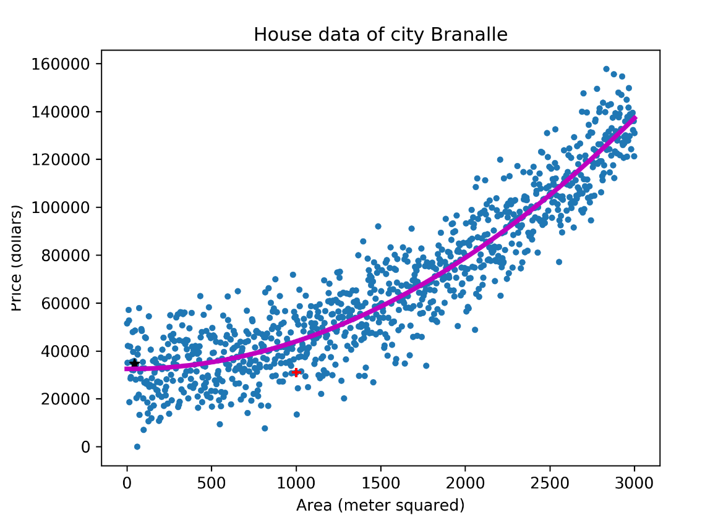

**Aplications**
- Advertising Popularity Prediction
- Weather Forecasting
- Market Forecasting
- Estimating Life expectancy
- Population Growth Prediction

#### Types
Minor types
* Logistic regression
* Support vector regression
* Decision tree regression
* Random forest regression
* Ridge regression
* Lasso regression

Important types

##### Linear Regression
* It’s a linear model
  * an equation that describes a relationship between two quantities that show a constant rate of change.
  * e.g the older I get, the wiser I will be (hopefully)
  * Attending all lectures in Intro to A.I course will result in passing the exam
* There is always an input variable (x) and an output variable (y)
  * Y can be calculated from a linear combination of input variables (x)
* Two Types
  * Simple Linera Regression (single input value)
  * Muliple Linera Regression (multiple input value)

    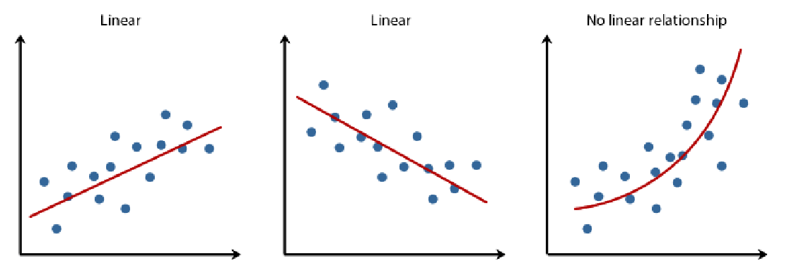

##### Polynomial Regression
- Also Linear, but curved line (like polynomial function hahah)
- Can create a better fit on values that seem to be curving

    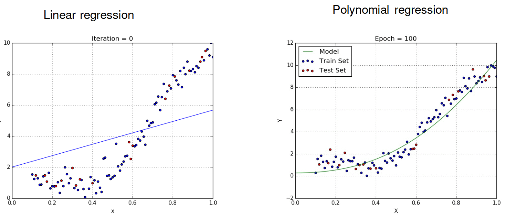

## Reinforcement learning

    

**Aplications**
* Game AI (Guessing the sort where an AI plays a game)
* Skill Acuisition
* Learning Tasks
* Robot Navigation
* Real-time desciscions

* Reinforcement Learning is a type of machine learning technique that enables an agent to learn in an interactive environment by trial and error using feedback from its own actions and experiences.
* Whenever the model predicts or produces a result, it is penalized if the prediction is wrong or rewarded if the prediction is correct.

**Challenges with Reinforcement learning**
* The main challenge in reinforcement learning lays in preparing the simulation environment, which is highly dependant on the task to be performed. 
* Scaling and tweaking the neural network controlling the agent is another challenge. There is no way to communicate with the network other than through the system of rewards and penalties.

# Limitations

## Excitement around AI
* PwC and McKinsey have predicted that AI will add $16 trn to the world economy by 2030
* Google’s boss, has described developments in AI as “more profound than fire or electricity”. 
* AI is an advanced algorithm: All things which were impossible to do by human programmers can be done by A.I
* Autonomous robots (we will be able to make General A.I).
* AI is the new electricity: Its a force which will power everything
* Self driving car companies predict that robo taxis will revolutionalize transport
* In 2016 Geoffrey Hinton, remarked that we should stop training radiologists and instead unleash the power of A.I in health
* An AI firm called BlueDot claims it spotted signs of a novel virus in reports from Chinese hospitals as early as December 2019 (ref Economist).
* Almost all companies today either have an A.I strategy or are thinking of adopting one.

    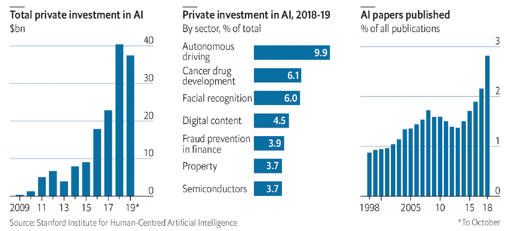

## Reality of AI
* A.I has evolved, yes, but it is still far away from the promise of a fully autonomous system
* Self driving cars are more capable but still are not safe enough to put on the streets
* Use of A.I in health is taking longer than expected. There is still a worldwide shortage of human radiologists
* Most companies find A.I hard to implement
* a survey of European ai startups by mmc, a venture-capital fund, found that 40% did not seem to be using any ai at all (ref: Economist)

## Examples
**The hype of A.I has far exceeded the science of A.I**
**After years of hype, people think A.I has still not delivered**
**Training an A.I algorithm to achieve the last 10% is much much harder than the first 90%**

### 1. Driverless Cars
1. Tesla claims to have autonomous driving (2018) but drivers still need to keep their hands on the wheels
2. General Motors planned to launch self driving taxis in San Francisco by 2019.
3. In 2019 a self drivign car by Uber became the first to kill a pedestrian
4. Waymo in America and WeRide in China, are geographically limited and rely on human safety drivers. 
5. Many driverless car startups going bankrupt because the technology is hard to master

### 2. Data is harder to come by
1. Amazon Go stores was a unique idea. So unique that it was hard for them to find data to train their algorithms
  1. there was no such training  set featuring people browsing  in shops.
  2. They fixed this  by creating a virtual  shopping  environment
2. An A.I health system designed to work for one hospital might not have the same results for another hospital

**Data Bias:**
1. Most facial recognition systems today use a higher proportion of white faces as training data (study by IBM in 2019)
2. Companies today cannot discriminate on sex, age or race while recruiting people but A.I algorithms can outsmart this process by using variables to reconstruct forbidden information

**More complications**  
* Self driving cars use a lot of virtual reality environments to train their cars since there are not so many self driving cars.
* Data annonimization is hard and still does not work 100%
* Facial recognition systems are sturggling to identify faces in the covid times where everyone covers their faces.

**Data Markets**
* Data preperation market was worth more than $1.5bn in 2019 and could grow to $3.5bn by 2024 (ref economist)
* The data labeling business could be $4.1bn by 2024 (ref economist)
* Data is the new oil term is not relevany anymore.
* Processed data is the key

### 3. Hard for businesses to adopt AI
**Use of A.I in corporations**
1. Most A.I examples we hear come from big tech giants (e.g Facebook, Amazon, Google, TikTok etc)
   - Their brilliant algorithms justify their over the top valuations
2. But adoption of A.I stops with tech giants
3. Non-tech companies find it harder to see the benefits of using A.I (ref: Boston consultancy)